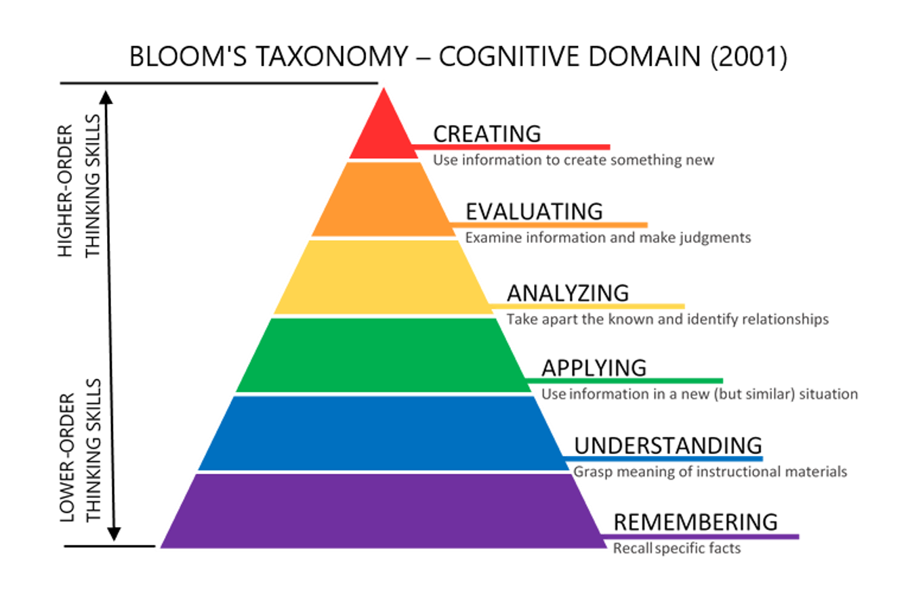
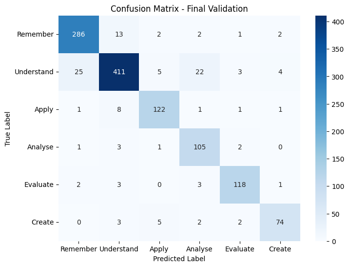
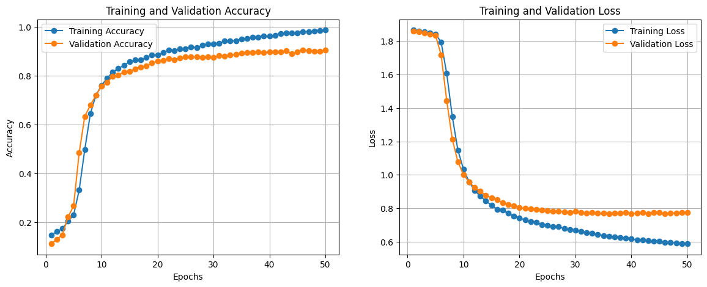

# BloomBERT: A Task Complexity Classifier

BloomBERT is a transformer-based NLP task classifier based on the [revised edition of Bloom's Taxonomy](https://en.wikipedia.org/wiki/Bloom%27s_taxonomy). 

Bloom's Taxonomy is a set of hierarchical models used in classifying learning outcomes into levels of complexity and specificity. Although mostly employed by educators for curriculum and assessment structuring, BloomBERT takes a novel approach in differentiating the difficulty of a task through `classifying productivity related tasks` into the cognitive domain of the taxonomy.

#### Example Outputs:

| Task Description                                                | BloomBERT Classification |
|-----------------------------------------------------------------|--------------------------|
| Programming an automated solution                               | Create                   |
| Preparing for the presentation of findings from market research | Apply                    |
| Reviewing performance metrics for this quarter                  | Evaluate                 |

#### Bloom's Taxonomy:


###### Description of Bloom's Taxonomy Levels [^1]
[^1]: [Bloom's Taxonomy Graphic](https://citt.ufl.edu/resources/the-learning-process/designing-the-learning-experience/blooms-taxonomy/blooms-taxonomy-graphic-description/)

## Model Overview

BloomBERT was built by finetuning a [DistilBERT](https://arxiv.org/abs/1910.01108) model, a lighter version of the original BERT transformer language model
developed by Google. It was developed using `Tensorflow` and the `Hugging Face Transformers library`, 
incorporating a sequence classification head (linear layers with dropout) on top of the DistilBERT pooled outputs. Utilising the pre-trained DistilBERT model, BloomBERT was trained with a labelled data set curated for the specific task classification on `Google Colab`.


#### Training Data Distribution:
| Bloom's Level | Count |
|---------------|-------|
| Create        | 430   |
| Evaluate      | 634   |
| Analyse       | 560   |
| Apply         | 671   |
| Understand    | 2348  |
| Remember      | 1532  |
| Total         | 6175  |

The training dataset has been curated from several sources alongside with some additional productivity-related tasks included by me.

#### Dataset references
```text
1. Devane et al.
https://www.kaggle.com/datasets/vijaydevane/blooms-taxonomy-dataset/data
2. Mohammed et al. (2020) 
https://doi.org/10.1371/journal.pone.0230442.s001
3. Yahya et al. (2012)
https://doi.org/10.1371/journal.pone.0230442.s002
```


#### BloomBERT Performance Evaluation

```text
Training Results:
    EPOCH: 50 
    training accuracy: 0.9862
    validation accuracy: 0.9036
```

> We evaluate `BloomBERT` based on a train-test split ratio of 0.2 to obtain the following results after finetuning for 50 epochs





By gradually unfreezing and finetuning the layers of the DistilBERT model, we achieve a smooth training and validation curve, with consistent increase in both training and validation accuracy, indicating potential room for further improvements.


## Development Journey

- [ ] Naive-Bayes (TF-IDF Vectorizer)
- [ ] Naive-Bayes (TF-IDF Vectorizer + SMOTE)
- [ ] SVC (TF-IDF Vectorizer)
- [ ] SVC (TF-IDF Vectorizer + SMOTE)
- [ ] SVC (word2vec, spaCy)
- [X] DistilBERT Transformer model

### Model Performance Comparison:

| Model                    | NB (TF) | NB (TF+SM) | SVC (TF) | SVC (TF+SM) | SVC (w2v+sp) | DistilBERT | 
|--------------------------|:-------:|:----------:|:--------:|:-----------:|:------------:|:----------:|
| Validation <br> Accuracy | 0.7579 |  0.8267   | 0.8599  |   0.8713   |   0.8170    |  0.9036   |

### 1. Naive-Bayes (TF-IDF Vectorizer)
* Starting with the Naive-Bayes algorithm that is often employed for multiclass classification problems, 
this model was used as a performance benchmark against other models.
```text
Validation Accuracy: 0.7579
```

### 2. Naive-Bayes (TF-IDF Vectorizer + SMOTE)
* After observing the presence of data imbalance, Synthetic Minority Oversampling Technique (SMOTE) was implemented
in attempts to oversample minority data points to create a balanced dataset and achieve better classification results.
* Using SMOTE successfully improved classification accuracy of the Naive-Bayes Model
```text
Validation Accuracy: 0.8267
```

### 3. SVC (TF-IDF Vectorizer)
* To improve model accuracy, I looked into using a Linear Support Vector Classifier (SVC) for the multi-classification problem.
* SVCs were determined to outperform Naive-Bayes in this specific classification problem with a much higher validation accuracy observed. 
* However, the model still fails to generalise well when given inputs of similar semantics.
```text
Validation Accuracy: 0.8599
```

### 4. SVC (TF-IDF Vectorizer + SMOTE)
* Applying SMOTE to this model showed slight improvements in classification accuracy.
* However, it still suffers from the same problems as the above few models.
```text
Validation Accuracy: 0.8713
```


### 5. SVC (word2vec, spaCy)
* To address the problem, I looked into using word2vec (word2vec-google-news-300) in replacement of TF-IDF Vectorizers to extract semantic relations from words within the sentences.
* This model uses spaCy models to tokenise the inputs before feeding the tokens into the word2vec model.
* Each word vector generated from the tokens are then averaged to form a sentence vector input for the SVC model.
* Unexpectedly, there was a significant drop in accuracy compare to the previous model using TF-IDF.
```text
Validation Accuracy: 0.8170
```

### 6. DistilBERT Transformer model
* After doing more research, I approached the problem from another angle using deep learning.
* Transformer models had demonstrated significant improvements over traditional NLP systems, excelling in processing sequential data and understanding language semantics.
* DistilBERT was chosen as the transformer model of choice due to its smaller size and greater speed compared to the original BERT model.
* The pre-trained model was then fine-tuned using the data set that I had developed using the taxonomy.
* It achieved the best accuracy compared to previous models and generalised well to unseen data with similar semantics, providing satisfactory predictions that fit within the taxonomy.
* This was the model chosen for `BloomBERT`. 
```text
Validation Accuracy: 0.9036
```

### Concluding Thoughts

Classifying Bloom’s taxonomy is a rather interesting problem with multiple potential approaches. In this work, `BloomBERT` solely demonstrates the efficacy of applying DistilBERT with a sequential classifier head on a multiclass classification task.

However, tasks do not always fit neatly into a single Bloom’s category. This opens up the possibility of framing the problem as a multilabel classification task.

Another interesting direction is to explore the `ordinal` or `hierarchical` structure of the taxonomy. Since Bloom’s levels are ranked in increasing cognitive complexity (e.g., `Create` > `Evaluate` > `Understand`), we could design models that respect this ordering. For instance, misclassifying a `Create` task as `Evaluate` is less severe than misclassifying it as `Remember`. Regularisation techniques or an ordinal regression formulation could enforce such constraints.

These avenues present exciting opportunities for future research beyond the baseline demonstrated here.


## License

[](https://opensource.org/licenses/MIT)

Source codes for model development are available under the MIT License. Developed by [Ryan Lau Q. F.](https://github.com/RyanLauQF)

## Citation

```
@misc{BloomBERT,
  author = {Ryan Lau Q. F.},
  title = {BloomBERT: A Task Complexity Classifier},
  year = {2025},
  howpublished = {\url{https://github.com/RyanLauQF/BloomBERT}}
}
```
